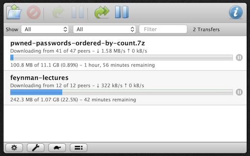

# Transmission
An [Übersicht](http://tracesof.net/uebersicht) widget that lets you monitor an instance of the [Transmission BitTorrent client](https://transmissionbt.com) using its standard web interface.

## Instructions
1. Edit transmission.coffee to set the `url` variable to the URL of your Transmission client's web interface.
2. If you have set your Transmission web interface to require a password:
	1. Visit it in Safari and save the password in your keychain.
	2. Refresh this widget in Übersicht.
	3. When prompted, allow Übersicht to access the keychain item.

If the prompt does not appear, you can manually grant Übersicht permission to access the keychain item:

1. Open the Keychain Access application.
2. Find and open the keychain item that holds the password you just saved.
3. Add Übersicht to the list of allowed applications in the keychain item's Access Control list.
