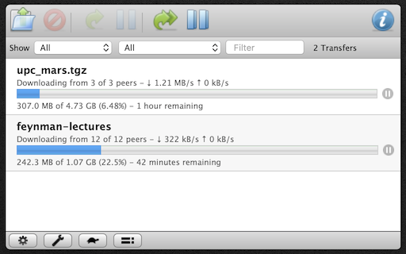

# Transmission
An [Übersicht](http://tracesof.net/uebersicht) widget that lets you monitor and control an instance of the [Transmission BitTorrent client](https://transmissionbt.com) using its standard web interface.

## Instructions
1. Edit transmission.coffee to set the `url` variable to the URL of your Transmission client's web interface.
2. If you have set your Transmission web interface to require a password:
	1. Visit it in Safari and save the password in your keychain.
	2. Refresh this widget in Übersicht.
	3. When prompted, allow Übersicht to access the keychain item.
3. To control Transmission, enable and use the Interaction Shortcut setting in Übersicht's preferences.

## Troubleshooting
If the prompt to allow Übersicht to access the keychain item does not appear as expected, you can manually grant Übersicht the necessary permission:

1. Open the Keychain Access application.
2. Find and open the keychain item that holds the password you just saved.
3. Add Übersicht to the list of allowed applications in the keychain item's Access Control list.

## License
This work is released under the [CC0 license](https://creativecommons.org/publicdomain/zero/1.0/):

To the extent possible under law, the author has waived all copyright and related or neighboring rights to the software.
